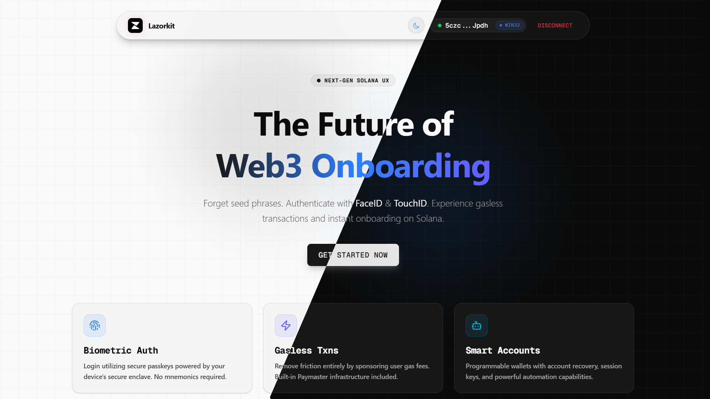

# Lazorkit Next.js Starter



> **Build Solana apps without seed phrases. Use FaceID, TouchID, or Windows Hello instead.**

A production-ready starter template demonstrating [Lazorkit SDK](https://docs.lazorkit.com) integration with Next.js, TypeScript, and Tailwind CSS.

## Quick Start

```bash
git clone https://github.com/exyreams/lazorkit-nextjs-starter.git
cd lazorkit-nextjs-starter
bun install && bun dev
```

Open http://localhost:3000 and click "Connect Wallet" to get started.

## Features

- **Passkey Authentication** - Sign in with FaceID, TouchID, or Windows Hello
- **Gasless Transactions** - Send SOL without holding SOL for gas fees
- **USDC Transfers** - Send SPL tokens with gas paid in USDC
- **Smart Wallets** - Programmable accounts with recovery support
- **Message Signing** - Verify ownership without transactions
- **Modern UI** - Responsive design with Tailwind CSS

## Documentation

### Getting Started

- **[Getting Started Guide](./GETTING_STARTED.md)** - Complete setup and feature walkthrough

### Tutorials

- **[Passkey Authentication](./docs/passkey-authentication.md)** - Implement biometric login
- **[Gasless Transactions](./docs/gasless-transactions.md)** - Send transactions without gas fees

### Examples

- **[Examples Directory](./examples/)** - Working code examples with Next.js configuration
  - [Basic Setup](./examples/basic-setup/) - Minimal Lazorkit integration
  - [Authentication](./examples/authentication/) - Complete passkey auth flow
  - [Transactions](./examples/transactions/) - Gasless SOL/USDC transfers
  - [Components](./examples/components/) - Reusable React components

### Contributing

- **[Contributing Guide](./CONTRIBUTING.md)** - Customize and extend the starter

## Resources

- [Lazorkit Documentation](https://docs.lazorkit.com)
- [Lazorkit GitHub](https://github.com/lazor-kit/lazor-kit)
- [Lazorkit Telegram](https://t.me/lazorkit)
- [Live Demo](https://lazorkit-nextjs-starter.vercel.app)

## License

MIT License - Use this template freely for your projects!
