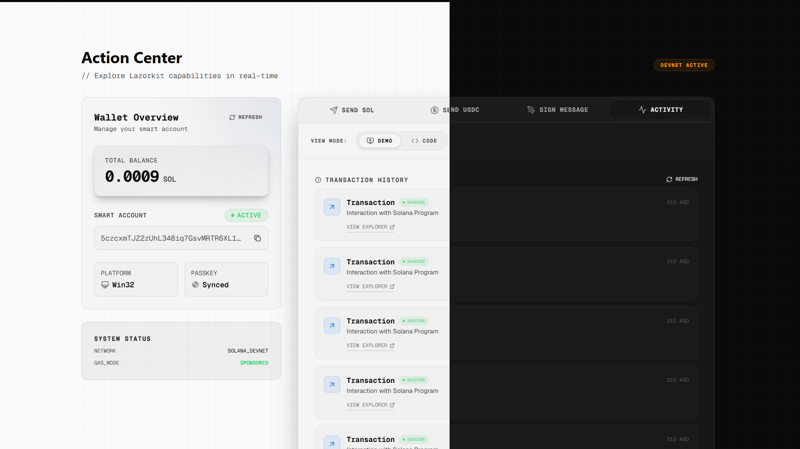
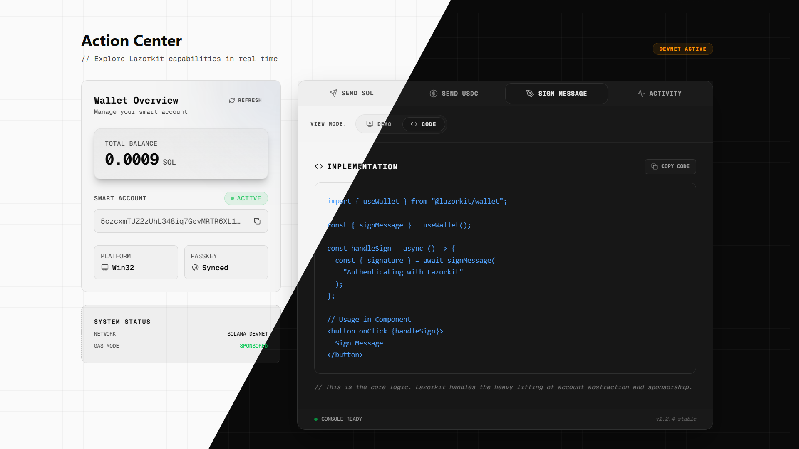
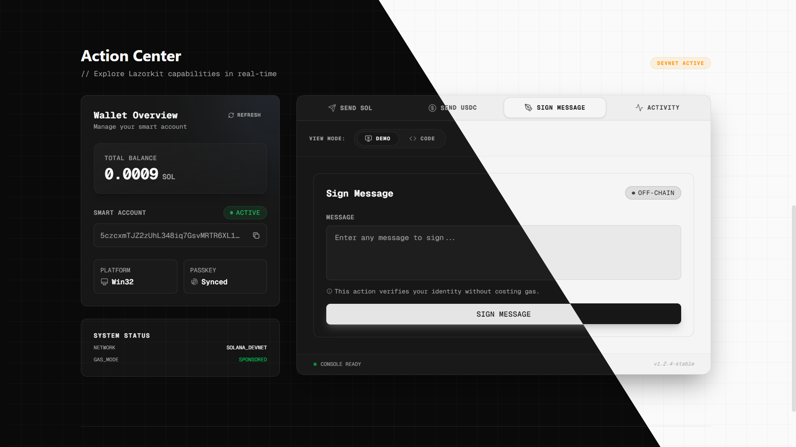
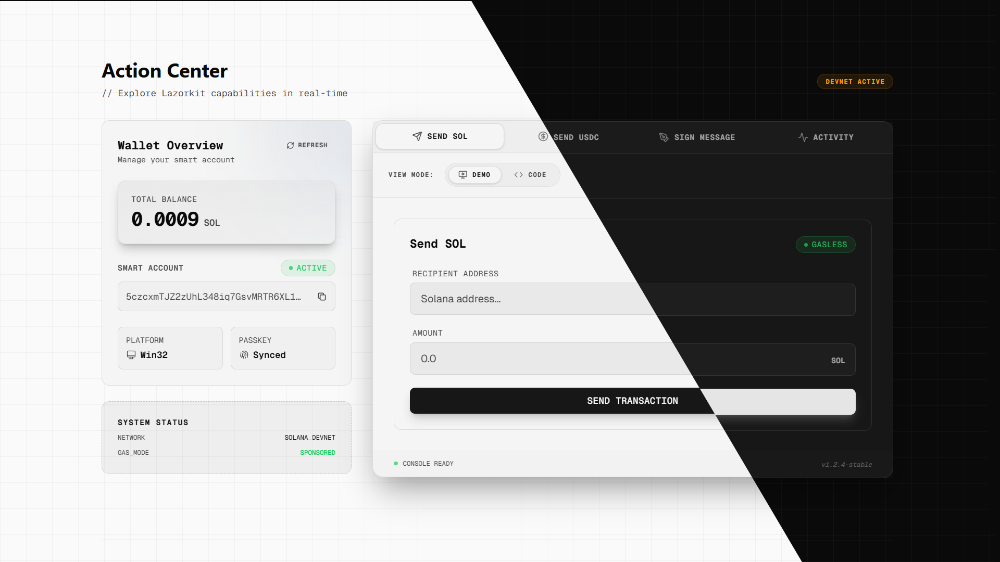
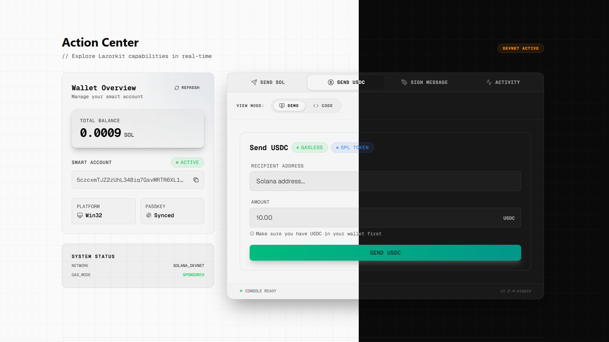

# Lazorkit Next.js Starter


> **Build Solana apps without seed phrases. Use FaceID, TouchID, or Windows Hello instead.**

A production-ready starter template demonstrating [Lazorkit SDK](https://docs.lazorkit.com) integration with Next.js, TypeScript, and Tailwind CSS.

**[Quick Start Guide](./GETTING_STARTED.md)** | **[Live Demo](https://lazorkit-nextjs-starter.vercel.app)** | **[Documentation](./docs/)**

## App Screenshots

### Activity Log



### Code Snippet View



### Message Signing



### SOL Transfer



### USDC Transfer



## Quick Start

```bash
git clone https://github.com/exyreams/lazorkit-nextjs-starter.git
cd lazorkit-nextjs-starter
bun install && bun dev
```

Open http://localhost:3000 and click "Connect Wallet" to get started.

## Documentation

For detailed setup instructions, features overview, and tutorials, please refer to our documentation:

- **[Getting Started Guide](./GETTING_STARTED.md)** - Complete setup and feature walkthrough
- **[Passkey Authentication](./docs/passkey-authentication.md)** - Implement biometric login
- **[Gasless Transactions](./docs/gasless-transactions.md)** - Send transactions without gas fees
- **[Contributing Guide](./CONTRIBUTING.md)** - Customize and extend the starter

## Resources

- [Lazorkit Documentation](https://docs.lazorkit.com)
- [Lazorkit GitHub](https://github.com/lazor-kit/lazor-kit)
- [Lazorkit Telegram](https://t.me/lazorkit)

## Contributing

This starter template is open source and welcomes contributions. Feel free to:

- Fork and customize for your projects
- Submit improvements via pull requests
- Share projects built with this template
- Report issues or suggest features

## License

MIT License - Use this template freely for your projects!
